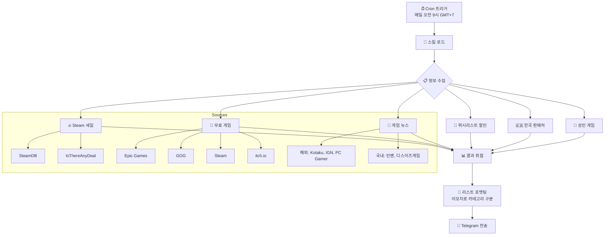

# Hot Game Deals & News 🎮📰

OpenClaw 스킬 - 게임 세일, 무료 게임, 뉴스를 체크해서 리스트 형태로 보고

## 동작 순서



## 기능

### 🔥 게임 세일
- SteamDB 세일 캘린더
- IsThereAnyDeal 가격 히스토리
- 연간 메이저 세일 (Spring, Summer, Autumn, Winter)

### 🎁 무료 게임
- Epic Games
- GOG
- Steam
- itch.io

### 🇰🇷 한국 판매처
- 다이렉트게임즈 (DirectG)

### 🔞 성인 게임
- Steam, DLsite, Kagura Games, JAST USA, MangaGamer

### 📰 게임 뉴스
- 해외: Kotaku, IGN, PC Gamer, Eurogamer, Rock Paper Shotgun
- 국내: 인벤, 디스이즈게임

## 사용법

OpenClaw에서 스킬을 설치하면 자동으로 인식됩니다.

```bash
# 스킬 설치 위치에 복사
cp -r hot-game-deals-n-news ~/.openclaw/skills/
```

## Cron Job 설정

매일 오전 9시 (GMT+7) 자동 실행:

```json
{
  "schedule": {"kind": "cron", "expr": "0 2 * * *", "tz": "UTC"},
  "payload": {
    "kind": "agentTurn",
    "message": "hot-game-deals-n-news 스킬을 로드해서 오늘의 게임 세일, 무료 게임, 뉴스를 체크하고 리스트 형태로 요약해줘."
  }
}
```

## API Keys

`references/api-keys.md`에 API 키를 설정해야 합니다:

- Steam API Key
- IsThereAnyDeal API Key

⚠️ **보안:** API 키는 git에 커밋하지 마세요!

## 라이선스

MIT
